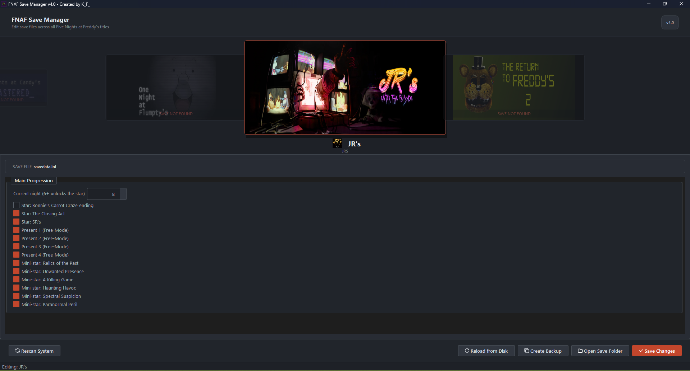

# FNAF Save Manager & Editor

**Created by:** K_F_

Welcome to the ultimate **FNAF Save Manager**, a powerful and user-friendly save editor built with Python and PySide6. Whether you lost your game progress or just want to explore everything the games have to offer, this tool allows you to instantly modify your save files across the Five Nights at Freddy's franchise. 

With just a few clicks, you can **unlock all nights, get max stars, earn completion certificates, and trigger hidden easter eggs** for the first 6 mainline games plus Ultimate Custom Night (UCN).

---

## 🌟 Supported Games & Features
This save editor fully supports the standard `.ini` save files generated by the Clickteam Fusion engine for the following titles:

* **FNAF 1, 2, 3, & 4:** Unlock Night 5, Night 6, Custom Night (Night 7), and 3-Star profiles.
* **FNAF 5: Sister Location:** Bypass difficult nights, unlock the private room, and earn all stars.
* **FNAF 6: Freddy Fazbear's Pizzeria Simulator:** Edit your Faz-Rating, modify cash, and unlock all certificates (Lorekeeper, Blacklisted, etc.).
* **Ultimate Custom Night (UCN):** Maximize your high scores and unlock all cutscenes/offices.

**Core Capabilities:**
* 🔓 **Unlock Everything:** Instantly beat nights and get all achievements.
* 🛠️ **Easter Eggs & Extras:** Toggle hidden minigames and lore events directly in the save data.
* 🖥️ **Modern UI:** A clean, intuitive graphical interface powered by PySide6, making save modding accessible to everyone.

---

## 🚀 Future Updates (Roadmap)
We are actively working on expanding the capabilities of the FNAF Save Manager. Coming in future releases:

* **FNAF World Support:** Direct modification and management of FNAF World save data directly from its `MMFApplications` directory.
* **Exact Checkpoint Saving (Save-States):** Advanced features allowing you to save at exact moments or checkpoints *between* or *during* nights—especially useful for the complex narrative sequences in **FNAF Sister Location**.

---

## 📂 Where are FNAF Save Files Located?
By default, the FNAF Save Manager automatically detects your game data. However, if you are looking for them manually, standard FNAF save files are located in your Windows AppData folder:
`C:\Users\YOUR_USERNAME\AppData\Roaming\MMFApplications`

---

## 🛠️ Built With
*  - Core logic and `configparser` save parsing
*  - UI Framework & Frontend Design

---

## 📝 License & Disclaimer
This project is for educational and personal use only. It is not affiliated with Scottgames. Please support the official *Five Nights at Freddy's* franchise and its creator, Scott Cawthon, by purchasing the official games.
